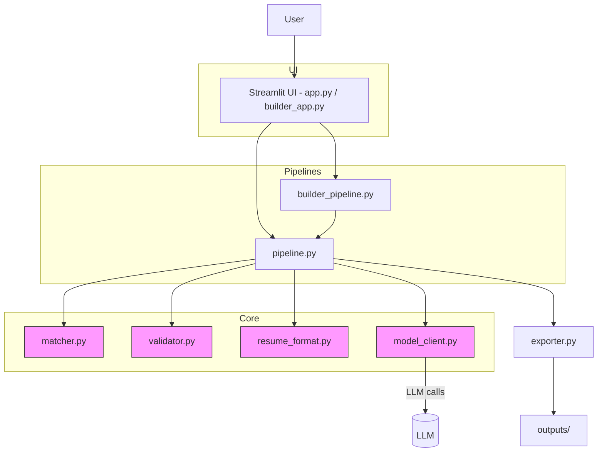

# Agentic Resume Optimizer & Builder

An open-source toolkit that helps professionals and recruiters generate and optimize resumes using a mix of deterministic Python logic and targeted LLM calls.

Key capabilities:
- Optimize an existing resume for a specific job description (ATS-friendly rewrite, skill alignment, validation).
- Build a resume from GitHub evidence and optional inputs (profile, READMEs, repos).

The design principle is pragmatic: keep deterministic logic in Python and use the LLM only for language understanding and structured resume generation.

## Architecture



## Features
- Parse and score resumes against job descriptions.
- Identify matched and missing skills and surface improvement suggestions.
- Rewrite resumes into a clean, ATS-friendly format while preserving numeric achievements.
- Validate claims to reduce unsupported or unverifiable statements.
- Build candidate profiles from GitHub repositories and README files.
- Export results to Markdown, DOCX, PDF, and plain text.

## Repository layout
- `app.py` — Streamlit frontend for optimizer flow.
- `builder_app.py` — Streamlit UI for the GitHub-based builder flow.
- `pipeline.py` — Main optimization pipeline.
- `builder_pipeline.py` — Builder flow that extracts GitHub evidence.
- `model_client.py` — LLM integration and JSON repair utilities.
- `matcher.py` — Skill extraction and matching logic.
- `validator.py` — Truthfulness and quality checks.
- `resume_format.py` — Structured resume model and renderers.
- `exporter.py` — Export helpers (MD, DOCX, PDF, TXT).
- `requirements.txt` — Python dependencies.

## Quickstart (Windows)
1. Clone the repo:

```powershell
git clone https://github.com/harshitttiwari/Resume-OPT.git
cd Resume-OPT
```

2. Create and activate a virtual environment:

```powershell
python -m venv .venv
.venv\Scripts\activate
```

3. Install dependencies and run the app:

```powershell
pip install -r requirements.txt
streamlit run app.py
```

On macOS / Linux replace the venv activation command with `source .venv/bin/activate`.

## Usage overview

Optimizer mode (via the Streamlit UI):
- Upload an existing resume (PDF or text) and paste a job description.
- The app will parse, score, and suggest a rewrite tailored to the JD.
- Review edits, run validation, then export.

Builder mode (via the Streamlit UI):
- Provide a GitHub profile or repository URL.
- The builder extracts README and repo evidence, asks for any missing context, then generates a resume draft.

CLI / programmatic usage
The core pipelines (`pipeline.py`, `builder_pipeline.py`) expose functions you can call from Python if you prefer programmatic access.

## Outputs
- Optimized resumes are saved under `outputs/` with `optimized_resume_<id>.md` by default.

## Configuration & secrets
- API keys and other secrets are expected to be provided via environment variables or a local config — do not commit secrets.

## Development notes
- Tests: (none included by default). Add unit tests for `matcher.py` and `validator.py` when expanding features.
- Contributions: PRs are welcome. Please open an issue first for larger changes.

## Contributing
- Fork the repo, create a feature branch, and open a PR with tests and a clear description.

## License & contact
- This repository is provided as-is. Check the project root for a `LICENSE` file or add one if needed.
- For questions, open an issue or contact the maintainer listed on the GitHub profile.

---
